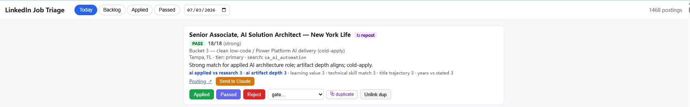
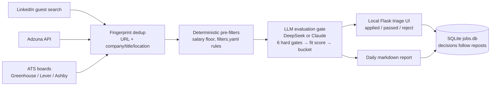

# jobsearch_pipeline

**LLM-gated job-posting triage.** Fetches postings from LinkedIn (guest endpoints), the
Adzuna API, and company ATS boards (Greenhouse/Lever/Ashby); dedupes them; runs each
genuinely new posting through an LLM evaluation gate scored against your own profile and
evaluation rules; and writes you one ranked markdown report a day — plus a local web UI
for one-click triage. You open one screen, not fifty tabs.

**It never touches your LinkedIn account. Do not add login cookies to it.** All personal
files (profile, evaluation rules, database, reports) are gitignored; the repo ships
`*.example.*` templates.



## Why it exists

Job boards optimize for volume; a search optimizes for judgment. Deterministic pre-filters
(a salary floor, your `filters.yaml` rules) kill obvious no's before a single token is
spent, and the LLM evaluation checks six hard gates (years floor, role substance, work
authorization, …) before it scores fit — so the paid judgment goes only to real maybes.
The rules live in two plain-markdown files you write — `profile.md` and
`evaluation_guide.md` — so the gate reads like you would, not like a keyword filter.

The design decision that matters most: **verdicts route, they don't just rank.** Some
roles never convert from a cold portal application and only move through a recruiter or
referral — so instead of a yes/no, every passing posting is routed cold-apply vs.
route-to-a-human, based on rules in your evaluation guide. Matching effort to channel
is worth more than another point of scoring precision.

## How it works



Two-layer dedup catches the same role relisted under a fresh URL, and an applied/passed
decision follows the role across every future repost — the double-apply guard.

Source notes: LinkedIn is the one *scrape* source that still works (Indeed, Glassdoor,
ZipRecruiter, and Google Jobs are all behind anti-bot walls), and it is read through
logged-out guest endpoints only. Adzuna is an official free **API**; its postings carry
only a 500-char description snippet, flagged as such in the report and UI. The ATS
boards are public no-auth JSON APIs with no search query — you list companies in
`config.yaml`, and shared title/location filters decide what enters the pipeline — and
their postings carry **full** job descriptions, so the evaluator sees the whole JD.
Adzuna and the ATS boards are optional and off until configured (setup steps 6–7).

## By the numbers

Running since June 19, 2026 (2 scheduled runs/day through early July, every 3 hours across
waking hours since — see §5): 13,268 postings fetched and deduped as of early July,
13,205 evaluated, 1,907 reposts caught by fingerprint dedup. The default evaluator
(`deepseek-v4-flash`) costs ~$0.07/run at typical volume; a Claude Sonnet option trades
~50× cost for better judgment on edge cases.

## Honest limits

- The cheap default evaluator deliberately under-filters; §8's reject/pattern flow
  exists because it misses hard fails a human catches in seconds.
- LinkedIn's guest endpoint breaks occasionally; the pipeline is a convenience layer
  over a moving target (see Troubleshooting).
- PASS means "worth your read," not "apply." The tool compresses triage; it doesn't
  replace judgment.

---

# Setup & usage (Windows)

## 1. One-time setup

1. Install Python 3.10+ from python.org (check "Add Python to PATH" during install).
2. Unzip this folder somewhere permanent, e.g. `C:\jobsearch_pipeline`.
3. Open Command Prompt in that folder and run:
   ```
   pip install -r requirements.txt
   ```
4. Create your private files from the shipped templates, then edit them:
   ```
   copy config.example.yaml config.yaml
   copy profile.example.md profile.md
   copy evaluation_guide.example.md evaluation_guide.md
   ```
   Edit `profile.md` and `evaluation_guide.md` to describe *your* situation and how *you*
   want postings judged — they are the evaluator's brain. Adjust searches in `config.yaml`.
5. Set your API key (one-time, persists across reboots). Use whichever provider you set in
   `config.yaml` — the default is `deepseek` → `DEEPSEEK_API_KEY`; switch to `anthropic` →
   `ANTHROPIC_API_KEY`:
   ```
   setx DEEPSEEK_API_KEY "sk-..."
   ```
   Close and reopen Command Prompt after this.
6. *(Optional)* Enable the Adzuna source: register a free app at https://developer.adzuna.com/,
   then set both credentials and add an `adzuna:` block to the searches you want it to cover
   (see `config.example.yaml` for the query syntax — Adzuna uses its own `what_phrase`/`what_or`
   params, not LinkedIn boolean):
   ```
   setx ADZUNA_APP_ID "..."
   setx ADZUNA_APP_KEY "..."
   ```
   Without these, the Adzuna source is simply skipped.
7. *(Optional)* Enable the ATS-board source: add an `ats:` block under `settings:` in
   `config.yaml` with the companies you want to track (see `config.example.yaml`). No API keys —
   the Greenhouse/Lever/Ashby board APIs are public. Find a company's board slug from its
   careers-page URL (`boards.greenhouse.io/<slug>`, `jobs.lever.co/<slug>`,
   `jobs.ashbyhq.com/<slug>`), or discover boards with a Google search like
   `site:boards.greenhouse.io "data analyst"`. The `title_any` filter is required — it's what
   keeps a 500-job board from flooding the paid eval — and the first run after adding a company
   evaluates its whole matching backlog once, so add companies gradually.

## 2. Test run

```
python pipeline.py run
```

First run will take a few minutes (9 searches × 20s delay + evaluations). Then open
`reports\report_YYYY-MM-DD.md`. If fetches fail, see Troubleshooting.

## 3. Commands (CLI)

You drive the pipeline by typing `python pipeline.py <command>` in a terminal (PowerShell or
Command Prompt) opened in the project folder. The commands:

| Command | What it does |
|---------|--------------|
| `run` | Full daily cycle: fetch → salary filter → evaluate → write today's report. The only one that hits the network/API (costs money). |
| `report` | Rebuild a report from the database — **free**, no fetching, no API calls. Defaults to today; `--date YYYY-MM-DD` for a past day. |
| `stats` | Quick database counts: by status/verdict, plus an application-status breakdown (applied / passed / backlog). |
| `ui` | Launch a **local web UI** for triaging postings by clicking instead of typing (see §4). |
| `applied --url X` | Mark a posting as **applied-to**. |
| `passed --url X` | Mark a posting as **reviewed & decided no**. |
| `reject --url X` | Override the model: mark a posting as a **hard-fail it let through**; `--pattern` also writes a reusable rule (see §8). |

**`--url` takes a unique substring**, not the whole URL — the LinkedIn job id is easiest. If
the substring matches more than one posting, the command refuses and lists them so you can be
more specific. Add **`--undo`** to `applied`/`passed`/`reject` to clear what you set by mistake.

```
python pipeline.py run                         # morning fetch + report
python pipeline.py applied --url 4431386393    # you applied to this one
python pipeline.py passed  --url 4431386393    # you looked and skipped this one
python pipeline.py passed  --url 4431386393 --undo   # oops, undo it
python pipeline.py report                      # refresh the report after marking
python pipeline.py report --date 2026-06-10    # rebuild a past day's report
python pipeline.py stats                        # counts
python pipeline.py prune --days 90 --vacuum     # (occasional) clear old rejected postings' text, shrink jobs.db
```

**Typical daily loop:** `run` in the morning → read the report and click through to jobs you
like → as you go, `applied` the ones you apply to and `passed` the ones you reject → `report`
to refresh. Passed jobs become muted, and a future repost of anything you applied to or passed
stays flagged (see Reading the report). Jobs you never mark stay in the backlog and keep
showing — nothing is hidden without your say-so. Marking is also how reposts avoid a
double-apply: an `applied` decision follows the role across every future relisting.

## 4. The triage UI (click instead of type)

If marking postings one `--url` at a time is slow, run a small local web app instead:

```
python pipeline.py ui
```

It opens `http://127.0.0.1:5000` in your browser. The page shows the same postings the report
does, as cards with their verdict, score breakdown, bucket, flags and a link to the posting.
Each card has **Applied** / **Passed** / **Reject** buttons (Reject has a gate dropdown), so a
click does exactly what the matching CLI command does — including repost-chain propagation. Tabs
switch between **Today** (with a date picker), the undecided **Backlog**, and your **Applied** /
**Passed** history; **Undo** reverses a decision.

It reads and writes the same `jobs.db`, makes no judgement of its own, and is local-only
(single user, no login). It needs Flask — `pip install -r requirements.txt` covers it. The
`--pattern` rule-writing flow stays on the CLI (`reject --pattern`), since it shows a
false-positive preview before saving. Stop the server with Ctrl-C.

**Send to Claude / ChatGPT.** Each card has a send button that copies the posting (a short
header plus the stored description) to your clipboard and opens your assistant project in a tab,
so you just paste (Ctrl+V) and run — no opening LinkedIn and copying by hand. Set your project
URL once in `config.yaml` — a claude.ai project, a ChatGPT project, or any chat page works, and
the button labels itself after whichever you configured:

```yaml
settings:
  feedback_project_url: "https://claude.ai/project/XXXXXXXX"
  # or e.g. "https://chatgpt.com/g/g-p-XXXXXXXX/project"
```

Leave it blank to just copy the JD without opening a tab. Because the pipeline already stores the
full "About the job" text, this never re-scrapes LinkedIn. The rare posting longer than
`max_description_chars` (~2%) is marked **⚠ JD may be truncated** and the posting URL is always
included in the copied text so you can open the original. This uses your chat project (and its
files/instructions) directly, so it's covered by your chat subscription — no API key or extra
cost.

## 5. Schedule (Task Scheduler)

1. Open **Task Scheduler** → **Create Task** (not "Basic Task").
2. General tab: name it `Job Pipeline`; select "Run whether user is logged on or not"
   only if your machine is always on — otherwise "Run only when user is logged on" and
   tick "Run task as soon as possible after a scheduled start is missed".
3. Triggers tab: add a Daily trigger repeating **every 3 hours across waking hours**
   (e.g. 8:00, repeat every 3h for a duration of **16 hours** → runs 8:00–23:00, 6/day).
   Task Scheduler stops repeating AT the duration boundary, so a 15h duration would silently
   drop the 23:00 run — size the duration one interval past the last run you want. New
   postings collect
   hundreds of applicants within hours, so running often — and being early — is what gets
   an application actually reviewed; the report/UI surface each posting's age and sort
   fresh strong matches first. Fewer runs work too — just keep `hours_old` ≥ the gap
   between runs (plus ~1h overlap).
4. Actions tab: Start a program → Program: `C:\jobsearch_pipeline\run_pipeline.bat`
   → "Start in": `C:\jobsearch_pipeline`.
5. OK to save. Right-click → Run once to verify; check the day's
   `logs\pipeline-YYYY-MM-DD.log` (one log file per day, pruned after 30 days).
   Heads-up: the .bat passes `--scheduled`, which skips the run (a `[cooldown]` line in
   the log, exit 0) if any successful run — including the §2 manual test — finished
   less than an hour earlier. Seeing that line IS a successful verification of the
   task wiring; to watch a full cycle instead, wait out the hour or run
   `python pipeline.py run` (manual runs never cooldown-skip).

The times don't need to be exact — `hours_old: 4` in config.yaml gives each run overlap
with the previous one, and the database dedupes anything seen twice. A waking-hours-only
schedule leaves a small overnight LinkedIn gap (postings made ~23:00–04:00); Adzuna's
1-day lookback and the full ATS board fetch cover those sources overnight regardless, and
raising `hours_old` on its own closes the gap if you ever notice morning misses.

## 6. Editing searches

Everything lives in `config.yaml` — add/remove searches, change Boolean terms, adjust the
salary floor. Analyst-tier searches carry `min_salary: 80000`: postings with a **known**
annual salary below that are dropped; postings with **no stated salary are kept** (this is
deliberately different from LinkedIn's own salary filter, which silently drops some
unlisted postings).

`profile.md` and `evaluation_guide.md` are the evaluator's brain. If your situation changes
(new certifications, a shipped project, a change in work authorization), update `profile.md` —
the next run picks it up automatically.

Changes to *how postings are judged* (scoring, verdicts, routing) are logged in
[`CHANGELOG.md`](CHANGELOG.md).

## 7. Reading the report

**Verdict sections** (how the evaluator triaged each posting):

- **Cold-apply (PASS)** = *worth your read*, not *apply*. The script reliably kills hard
  fails (years floors, clearance language, research-coded substance), but a research-coded
  role wearing an SA title can slip through — the ⚠️ flags mark where the
  evaluator was unsure. Strong-band (14–18) postings deserve a full manual gate check
  before you tailor anything. Each carries a **bucket**: 2 (acceptable-tier BI/BA) or
  3 (clean low-code / Power Platform AI delivery — where cold conversion is realistic).
- **Recruiter-only** = passed every gate and scored well, *but* matched the
  recruiter-routing rules defined in your `evaluation_guide.md` (`ai_artifact_depth` = 0,
  bucket 1). Cold portal applications convert near zero for some role shapes, while a
  recruiter or referral can carry a narrative an ATS can't — so route these to a human,
  don't cold-apply. This is the "50/0" fix: a hard verdict cap enforced in code stops a
  high total score from masking an unwinnable cold screen.
- **Needs manual review** = the guest endpoint returned no description. Open the link
  and eyeball it; takes seconds.
- **Gate fails** = one-liners for audit. Skim occasionally to confirm the evaluator
  isn't killing things you'd want — especially the first week, while you calibrate trust.

**Status markers** (your decisions + repost history, shown on a posting regardless of verdict):

- **↻ Repost — original first seen …** = the same role relisted under a new URL. The line
  carries the original's first-seen date and the chain's verdict (the most favorable one the
  evaluator ever gave this role) so you know you've seen it before. Relistings of a role that
  already holds a verdict are not re-evaluated — they appear in a compact "already-evaluated"
  report section instead of being re-scored.
- **🚫 ALREADY APPLIED — do not re-apply** = you ran `applied` on this role (or an earlier
  posting of it). The loudest marker — it's the double-apply guard.
- **↩ You reviewed & passed …** = you ran `passed` on it. A quiet note; the job stays visible
  in case you reconsider, but you've already decided no.
- **No marker** = backlog (you haven't acted on it yet) — shows normally. You set the applied/
  passed states with the `applied` / `passed` commands (see Commands); the full rationale is in
  [`CHANGELOG.md`](CHANGELOG.md).

There's also a **🚫 Hard-fail filters** section for postings you (or a rule) flagged as a hard
requirement you can't meet — see §8.

## 8. Hard-fail filters (catching the cheap model's misses)

The default DeepSeek evaluator is cheap and deliberately **under-filters** — it occasionally
lets through a posting you actually can't apply to (security clearance, US citizenship, a 10+
year floor, contract-only). Two ways to handle it:

- **Reject the one in front of you.** `python pipeline.py reject --url <id> --gate work_auth`
  records *your* hard-fail verdict, pulls the posting out of cold-apply into the report's
  **🚫 Hard-fail filters** section, and sticks across reposts. It keeps the model's original
  verdict, so a "(model under-filtered)" note shows when you overrule a PASS.
- **Stop it recurring.** Add `--pattern "secret clearance"` and `reject` also writes that
  phrase into **`filters.yaml`**, a deterministic ruleset that auto-fails *future* postings
  matching it — **before** the paid eval, so it costs nothing. Before saving, it shows the
  matching sentence and how many existing postings the pattern would also catch (a
  false-positive check). The `--gate` is one of the six hard gates — `years_floor`,
  `domain_requirement`, `role_substance`, `tool_requirement`, `work_auth`,
  `employment_type` — or `other` (see `evaluation_guide.md` for what each means; they're
  also listed in `python pipeline.py --help`).

A pattern is a **case-insensitive substring** unless you prefix it `re:`, which makes it a
**regex** (e.g. `re:\b1[0-9]\+? years` for 10+ years). `filters.yaml` is gitignored and
hand-editable — copy `filters.example.yaml` to start, or just let `reject` build it as you go.
Rule-failed and manually-rejected postings both appear in the auditable Hard-fail section so an
over-aggressive rule can't silently bury good jobs.

## Troubleshooting

- **Searches return 0 or error with 429/blocked**: LinkedIn is rate-limiting your IP.
  Raise `delay_between_searches` to 45–60, or drop to 2 runs/day — **and if you reduce the
  run frequency, raise `hours_old` to cover the new gap** (2 runs/day → 13), or each run
  silently misses every LinkedIn posting older than its window. Blocks on the guest
  endpoint are temporary (hours).
- **Every search errors after working previously**: LinkedIn changed the guest endpoint.
  Run `pip install -U python-jobspy` — the library usually patches within days. The
  pipeline is a convenience layer; expect occasional downtime.
- **`… _API_KEY not set`** (`DEEPSEEK_API_KEY` on the default config, `ANTHROPIC_API_KEY` if
  you switched provider): rerun the `setx` command for that key, then fully close and reopen
  the terminal (or reboot before the scheduled task runs).
- **Evaluation errors in report**: usually transient API issues; those rows stay in
  status `error` and are listed in the report so you can review them manually.

## Cost

The default evaluator is **`deepseek-v4-flash`** (`provider: deepseek` in config.yaml), which
runs at roughly **$0.07 per run** — about **50× cheaper** than Claude Sonnet — at typical
volume (30–80 new postings/day, ~1,500 words each). It's a reasoning model that under-filters
slightly (errs toward showing you more), which is fine since PASS means "worth your read," not
"apply."

To trade cost for evaluation quality, switch `provider`/`model` in config.yaml:
- **`anthropic` / `claude-sonnet-4-6`** — highest quality, ~**$0.50–$1.50/day**. Best on the
  judgment-call ⚠️ flags and research-coding edge cases.
- **`anthropic` / `claude-haiku-4-5-20251001`** — a middle option, ~5× cheaper than Sonnet;
  handles the mostly pattern-matching gate checks acceptably, weaker on the judgment calls.

Remember to set the matching API key (`DEEPSEEK_API_KEY` or `ANTHROPIC_API_KEY`) when you
switch providers.
